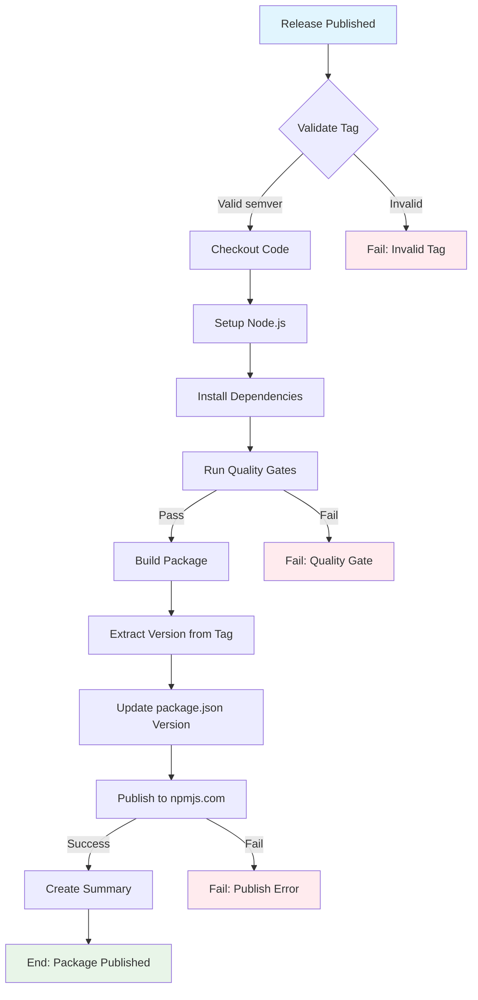
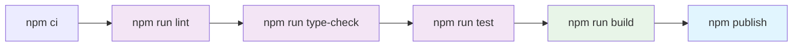

## Workflow Overview

**Purpose**: Automatically publish the `@j0hanz/filesystem-context-mcp` npm package to the public npmjs.com registry when releases are created, enabling installation via `npx -y @j0hanz/filesystem-context-mcp@latest`.
**Trigger Events**: Release published (tag-based versioning)
**Target Environments**: Public npm registry (`registry.npmjs.org`)

## Execution Flow Diagram



## Jobs & Dependencies

| Job Name | Purpose                                    | Dependencies | Execution Context |
| -------- | ------------------------------------------ | ------------ | ----------------- |
| publish  | Build and publish npm package to npmjs.com | None         | ubuntu-latest     |

## Requirements Matrix

### Functional Requirements

| ID      | Requirement                              | Priority | Acceptance Criteria                                  |
| ------- | ---------------------------------------- | -------- | ---------------------------------------------------- |
| REQ-001 | Publish package on release creation      | High     | Package appears on npmjs.com after release           |
| REQ-002 | Use release tag as package version       | High     | Package version matches git tag (v1.0.0 -> 1.0.0)    |
| REQ-003 | Run all quality gates before publish     | High     | Linting, type-checking, and tests pass               |
| REQ-004 | Build TypeScript to dist/ before publish | High     | Compiled JavaScript files included in package        |
| REQ-005 | Scope package to @j0hanz namespace       | High     | Package published as @j0hanz/filesystem-context-mcp  |
| REQ-006 | Publish as public package                | High     | Package accessible without authentication            |
| REQ-007 | Generate provenance statement            | Medium   | Build provenance verified on npmjs.com               |
| REQ-008 | Support npx execution                    | High     | `npx -y @j0hanz/filesystem-context-mcp@latest` works |

### Security Requirements

| ID      | Requirement                      | Implementation Constraint                          |
| ------- | -------------------------------- | -------------------------------------------------- |
| SEC-001 | Use NPM_TOKEN for authentication | Granular access token stored in GitHub Secrets     |
| SEC-002 | Generate provenance statements   | Use `--provenance` flag for supply chain security  |
| SEC-003 | Minimal permission scope         | `contents: read` and `id-token: write` permissions |
| SEC-004 | No secrets in logs               | NPM_TOKEN must be masked in workflow output        |
| SEC-005 | Verify package integrity         | Use npm lockfile for reproducible builds           |

### Performance Requirements

| ID       | Metric                  | Target       | Measurement Method    |
| -------- | ----------------------- | ------------ | --------------------- |
| PERF-001 | Total workflow duration | < 5 minutes  | GitHub Actions timing |
| PERF-002 | npm install time        | < 2 minutes  | Job step timing       |
| PERF-003 | Build time              | < 30 seconds | Job step timing       |
| PERF-004 | Publish time            | < 60 seconds | Job step timing       |

## Input/Output Contracts

### Inputs

```yaml
# Trigger Events
on:
  release:
    types: [published]

# Secrets Required
NPM_TOKEN: secret # Purpose: npmjs.com authentication (granular access token)

# Package Configuration (package.json)
name: '@j0hanz/filesystem-context-mcp' # Scoped package name
version: '1.0.0' # Initial version (overridden by release tag)
bin:
  filesystem-context-mcp: './dist/index.js' # CLI entry point for npx
```

### Outputs

```yaml
# Published Artifact
package: '@j0hanz/filesystem-context-mcp@1.0.0'
registry: 'registry.npmjs.org'
files:
  - dist/index.js
  - dist/**/*.js
  - dist/**/*.d.ts
  - package.json
  - README.md

# Provenance
provenance: true # SLSA Build Level 3 attestation

# Workflow Summary
summary: markdown # Published package details and installation instructions
```

### Secrets & Variables

| Type     | Name         | Purpose                   | Scope             |
| -------- | ------------ | ------------------------- | ----------------- |
| Secret   | NPM_TOKEN    | Authenticate to npmjs.com | Repository secret |
| Variable | NODE_VERSION | Node.js version for build | Default: 20       |

## Execution Constraints

### Runtime Constraints

- **Timeout**: 15 minutes maximum (workflow-level)
- **Concurrency**: Single concurrent publish per release
- **Resource Limits**: Standard GitHub-hosted runner resources

### Environmental Constraints

- **Runner Requirements**: ubuntu-latest with Node.js 20+
- **Network Access**: registry.npmjs.org
- **Permissions**:
  - `contents: read` - Checkout repository code
  - `id-token: write` - Generate OIDC token for provenance

### Package Configuration Requirements

The `package.json` must include:

```json
{
  "name": "@j0hanz/filesystem-context-mcp",
  "version": "1.0.0",
  "bin": {
    "filesystem-context-mcp": "./dist/index.js"
  },
  "files": ["dist"],
  "repository": {
    "type": "git",
    "url": "https://github.com/j0hanz/filesystem-context-mcp-server.git"
  }
}
```

**Note**: No `publishConfig.registry` needed for npmjs.com (it's the default).

## NPM Token Setup (One-Time)

### Creating an NPM Granular Access Token

1. Log in to [npmjs.com](https://www.npmjs.com/)
2. Go to **Access Tokens** → **Generate New Token** → **Granular Access Token**
3. Configure token:
   - **Token name**: `github-actions-publish`
   - **Expiration**: Custom (recommended: 1 year)
   - **Packages and scopes**: Select packages → `@j0hanz/filesystem-context-mcp`
   - **Permissions**: Read and write
   - **Organizations**: No access needed
4. Copy the generated token

### Adding Token to GitHub Repository

1. Go to repository **Settings** → **Secrets and variables** → **Actions**
2. Click **New repository secret**
3. Name: `NPM_TOKEN`
4. Value: Paste the npm token
5. Click **Add secret**

## Error Handling Strategy

| Error Type                     | Response      | Recovery Action                                |
| ------------------------------ | ------------- | ---------------------------------------------- |
| Lint Failure                   | Fail workflow | Fix lint errors and create new release         |
| Type-check Failure             | Fail workflow | Fix TypeScript errors and create new release   |
| Test Failure                   | Fail workflow | Fix failing tests and create new release       |
| Build Failure                  | Fail workflow | Fix build configuration and create new release |
| Publish Failure (403)          | Fail workflow | Check NPM_TOKEN permissions and package name   |
| Publish Failure (409 Conflict) | Fail workflow | Version already exists; bump version and retry |
| Publish Failure (402)          | Fail workflow | Scoped package needs `--access public` flag    |
| Publish Failure (Network)      | Retry once    | Manual re-run if persistent                    |

## Quality Gates

### Gate Definitions

| Gate         | Criteria               | Bypass Conditions |
| ------------ | ---------------------- | ----------------- |
| ESLint       | Zero errors            | None (required)   |
| TypeScript   | Zero type errors       | None (required)   |
| Vitest Tests | All tests pass         | None (required)   |
| Build        | Successful compilation | None (required)   |

### Quality Gate Execution Order



## Monitoring & Observability

### Key Metrics

- **Success Rate**: Target 99% (excluding user errors)
- **Execution Time**: < 5 minutes p95
- **Resource Usage**: Monitor via GitHub Actions usage reports

### Alerting

| Condition            | Severity | Notification Target                            |
| -------------------- | -------- | ---------------------------------------------- |
| Publish failure      | High     | Repository maintainers via GitHub notification |
| Quality gate failure | Medium   | Release author via GitHub notification         |
| Workflow timeout     | High     | Repository maintainers via GitHub notification |

## Integration Points

### External Systems

| System         | Integration Type     | Data Exchange                    | SLA Requirements   |
| -------------- | -------------------- | -------------------------------- | ------------------ |
| npmjs.com      | REST API via npm CLI | npm package tarball + provenance | 99.9% availability |
| GitHub Actions | Native integration   | Workflow triggers/status         | 99.9% availability |
| Sigstore       | OIDC for provenance  | Signed attestations              | 99.9% availability |

### Dependent Workflows

| Workflow                   | Relationship          | Trigger Mechanism                 |
| -------------------------- | --------------------- | --------------------------------- |
| CI (if exists)             | Should complete first | Branch protection (recommended)   |
| Release Drafter (optional) | Upstream              | Release creation triggers publish |

## Edge Cases & Exceptions

### Scenario Matrix

| Scenario                        | Expected Behavior           | Validation Method      |
| ------------------------------- | --------------------------- | ---------------------- |
| Duplicate version publish       | Fail with 409 Conflict      | Manual test            |
| Pre-release tag (v1.0.0-beta.1) | Publish with npm tag "beta" | Release test           |
| Missing NPM_TOKEN               | Fail with 401 Unauthorized  | Secret validation      |
| Package name unavailable        | Fail at npm publish         | Pre-registration check |
| Invalid semver tag              | Skip publish                | Tag format validation  |

### Version Handling

| Tag Format     | Package Version | npm Tag |
| -------------- | --------------- | ------- |
| v1.0.0         | 1.0.0           | latest  |
| v1.0.0-alpha.1 | 1.0.0-alpha.1   | alpha   |
| v1.0.0-beta.1  | 1.0.0-beta.1    | beta    |
| v1.0.0-rc.1    | 1.0.0-rc.1      | rc      |

## Validation Criteria

### Workflow Validation

- **VLD-001**: Workflow triggers only on `release: published` events
- **VLD-002**: Package version matches release tag (without 'v' prefix)
- **VLD-003**: All quality gates execute before publish step
- **VLD-004**: NPM_TOKEN is used for authentication
- **VLD-005**: Package is scoped to @j0hanz namespace
- **VLD-006**: `--access public` flag is used for scoped package
- **VLD-007**: `--provenance` flag generates supply chain attestation

### Performance Benchmarks

- **PERF-001**: npm ci completes in < 2 minutes
- **PERF-002**: Full workflow completes in < 5 minutes
- **PERF-003**: Publish step completes in < 60 seconds

## Installation Instructions (Post-Publish)

After the package is published, users can use it:

### As MCP Server (Primary Use Case)

```json
{
  "mcpServers": {
    "filesystem": {
      "command": "npx",
      "args": [
        "-y",
        "@j0hanz/filesystem-context-mcp@latest",
        "/path/to/allowed/dir"
      ]
    }
  }
}
```

### Direct Installation

```bash
# Install globally
npm install -g @j0hanz/filesystem-context-mcp

# Or run directly with npx
npx -y @j0hanz/filesystem-context-mcp@latest /path/to/scan
```

### Package URL

After publishing, the package will be available at:
`https://www.npmjs.com/package/@j0hanz/filesystem-context-mcp`

## Change Management

### Update Process

1. **Specification Update**: Modify this document first
2. **Review & Approval**: PR review by repository maintainer
3. **Implementation**: Apply changes to workflow YAML
4. **Testing**: Create test release with -rc or -beta tag
5. **Deployment**: Merge and verify with actual release

### Version History

| Version | Date       | Changes                                     | Author |
| ------- | ---------- | ------------------------------------------- | ------ |
| 1.0     | 2025-12-12 | Initial specification for npmjs.com publish | DevOps |

## Related Specifications

- [GitHub Actions Publishing Node.js Packages](https://docs.github.com/en/actions/publishing-packages/publishing-nodejs-packages)
- [npm publish documentation](https://docs.npmjs.com/cli/v10/commands/npm-publish)
- [Creating and publishing scoped public packages](https://docs.npmjs.com/creating-and-publishing-scoped-public-packages)
- [Generating provenance statements](https://docs.npmjs.com/generating-provenance-statements)

## Appendix: Required package.json Configuration

Ensure `package.json` includes these fields for npx/CLI support:

```json
{
  "name": "@j0hanz/filesystem-context-mcp",
  "version": "1.0.0",
  "bin": {
    "filesystem-context-mcp": "./dist/index.js"
  },
  "files": ["dist"],
  "repository": {
    "type": "git",
    "url": "https://github.com/j0hanz/filesystem-context-mcp-server.git"
  },
  "engines": {
    "node": ">=20.0.0"
  }
}
```

The `dist/index.js` must have the shebang line:

```javascript
#!/usr/bin/env node
```
